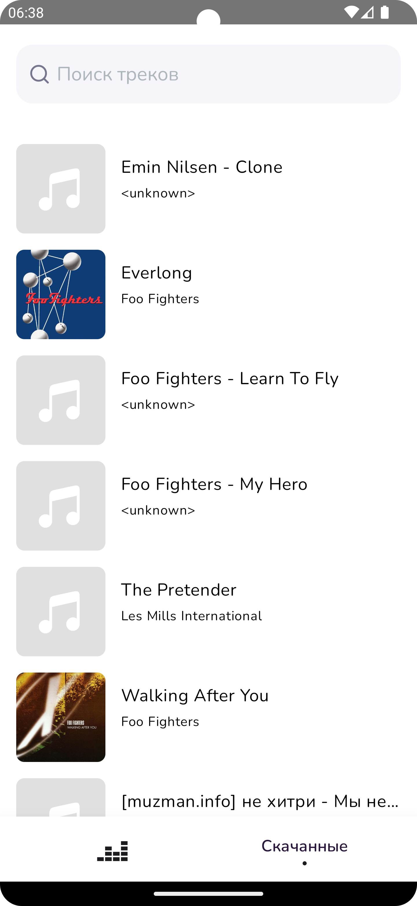
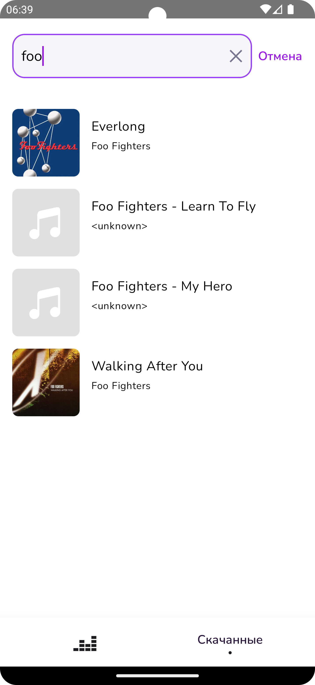
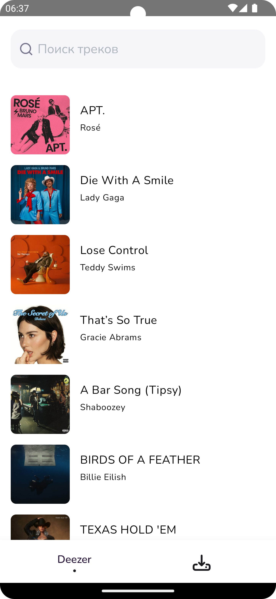
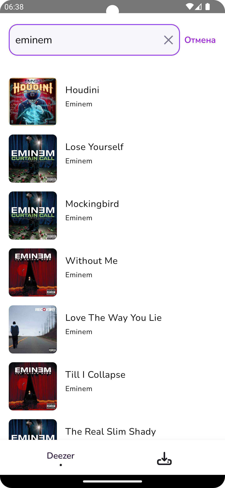
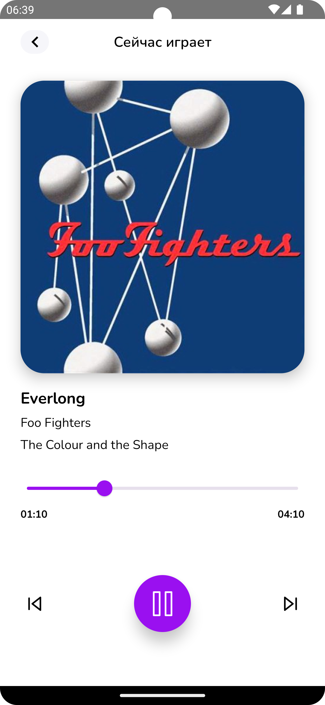

# Музыкальное Android-приложение

## Описание

Приложение позволяет:

- Искать музыку через Deezer API
- Воспроизводить найденные треки
- Управлять воспроизведением (пауза, продолжение, следующая/предыдущая песня)
- Воспроизводить локальные треки и искать по ним

## Функции приложения

### 🔹 Экран скачанных треков
- Отображает список локальных треков
- Поддерживает поиск по списку

**Скриншоты экрана:**

<div style="display: flex; justify-content: space-between;">
    
    
</div>

---

### 🔹 Экран треков из API
- Отображает популярные треки (Deezer API)
- Позволяет искать треки (Deezer API)

**Скриншоты экрана:**

<div style="display: flex; justify-content: space-between;">
  
  
</div>

---

### 🔹 Экран воспроизведения
- Отображает обложку трека/альбома
- Показывает название трека, исполнителя и альбома
- Позволяет управлять воспроизведением:
  - Пауза/Воспроизведение
  - Следующий/Предыдущий трек
  - Перемотка по прогресс-бару
  - Отображение текущего времени и длительности трека

**Скриншот экрана:**

<div style="display: flex; justify-content: space-between;">
  
</div>

---

### 🔹 Фоновый плеер
- Музыка продолжает воспроизводиться при сворачивании приложения
- Уведомление в статус-баре с контролами:
  - Воспроизведение/Пауза
  - Переключение треков
  - Перемотка треков

**Скриншот уведомления:**

<div style="display: flex; justify-content: space-between;">
  
</div>

---

## Стек технологий

- **Язык:** Kotlin
- **Работа с сетью:** Retrofit, OkHttp
- **Многопоточность:** Kotlin Coroutines + Flow 
- **UI:** Jetpack Compose
- **Навигация:** Jetpack Navigation
- **Архитектура:** MVVM
- **Фоновый плеер:** MediaSession, ExoPlayer
- **DI**:  Dagger
- **Архитектура**: Clean Architecture

## Установка и запуск

1. Клонируйте репозиторий:
   ```bash
   git clone https://github.com/BIBLETUM/DeezerPlayer.git
2. Откройте проект в Android Studio
3. Соберите и запустите на эмуляторе/устройстве

## Вопросы и принятые решения

### 🔹 Доступ к локальным файлам
**Проблема:** В задании не указано, что делать, если пользователь не дал разрешение на доступ к локальной музыке.  

**Решение:**  
- Если пользователь отказался от разрешения, его автоматически перенаправляет в системные настройки приложения, где он может вручную предоставить доступ.  
- На экране с локальной музыкой добавлено сообщение, информирующее пользователя о необходимости разрешить доступ и перезапустить приложение.  

Такой подход позволяет минимизировать вероятность того, что пользователь останется без локальных треков, и дает ему явное указание, как исправить ситуацию.  
